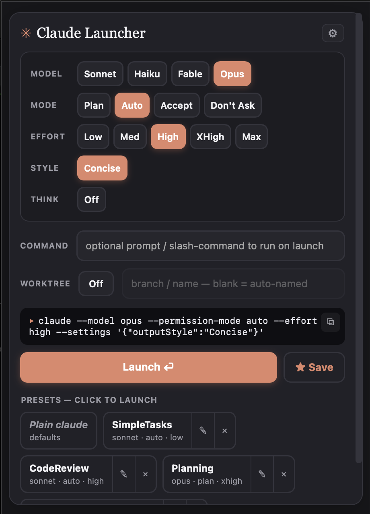
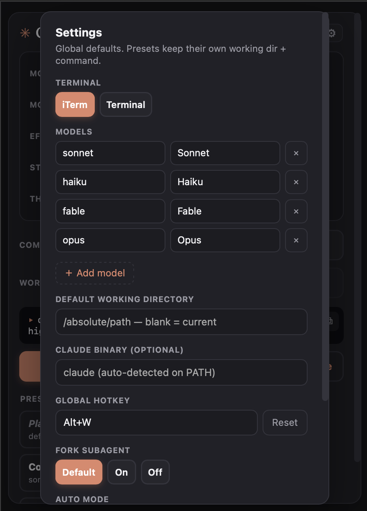

# Claude Session Launcher

A menu-bar/tray widget that launches a `claude` CLI session in your terminal with
model / permission-mode / effort (plus working directory and an initial command)
preselected — and lets you save named presets for one-click launch.

<p align="center">
  
  
</p>

## Install (macOS)

Download the latest **`Claude-Launcher-<version>-<arch>.dmg`** from the
[Releases page](https://github.com/jboho/claude-session-launcher/releases), drag it into
Applications, and get past Gatekeeper on first launch (the build is unsigned) — right-click →
Open, or `xattr -dr com.apple.quarantine "/Applications/Claude Launcher.app"`. Full steps and
the maintainer release flow are in [docs/INSTALL.md](docs/INSTALL.md).

## Develop

Requires Node 20+ and [pnpm](https://pnpm.io).

```bash
pnpm install
pnpm test      # unit tests (Vitest)
pnpm start     # build + launch the app
```

## Config (portable)

- Presets: `~/.config/claude-launcher/presets.json`
- Settings: `~/.config/claude-launcher/settings.json`
- Override the location with `CLAUDE_LAUNCHER_CONFIG=/path/to/presets.json`.

Both are plain JSON — sync them via dotfiles. Settings keys of note:

- `claudeBinary` — explicit path to the `claude` binary. Leave blank to use bare `claude` on PATH (auto-detected via a login-shell `command -v claude`, matching your terminal's own PATH).
- `models` — your own list of `{ value, label }` model entries, editable in Settings. Leave empty to use the built-in defaults (Opus / Sonnet / Haiku). Custom model values are unrestricted; known families (e.g. Haiku, including dated ids) still grey out Effort + Auto.
- `hotkey` — the global summon shortcut, set via the recorder in Settings. Defaults to Option+W (`Alt+W`) if unset or unavailable.

## Platform support (v1)

macOS only. `claude` is auto-detected on PATH, with an optional binary-path
override in Settings for non-standard installs. Only terminals actually
installed on the machine are offered (iTerm, Apple Terminal, Ghostty — Apple
Terminal is always available); the launcher falls back to Apple Terminal.
Windows/Linux report "not implemented in v1" — the spawner is the only
platform-specific piece.

## License

[Apache-2.0](LICENSE). Not affiliated with or endorsed by Anthropic; it launches the
`claude` CLI, which you install and license separately.
